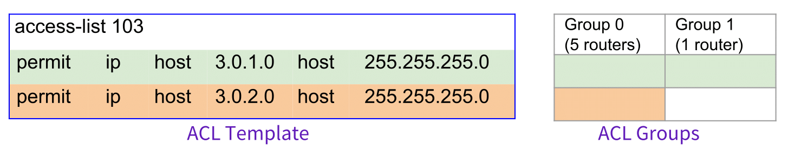

# SelfStarter

SelfStarter  automatically  infers  likely network configuration errors, without  requiring  a  formal  specification  and  working directly with existing network configuration files. Given the configuration files of a role, SelfStarter can infer a set of parameterized templates for complex  configuration  segments such as ACLs, PrefixLists and RoutePolicies by modeling  the  (likely)  intentional  differences as variations within a template while modeling the (likely) erroneous differences as variations across  templates  and  uses  the  templates  to  propose   high-quality configuration outliers.

:page_with_curl: [NSDI 2020](https://www.usenix.org/conference/nsdi20) -- [Finding Network Misconfigurations by Automatic Template Inference](https://www.usenix.org/conference/nsdi20/presentation/kakarla)


<details>

<summary><kbd>:arrow_down: CLICK</kbd>to reveal an ACL templating example.</summary>

Consider the [example configs](https://github.com/batfish/pybatfish/tree/master/jupyter_notebooks/networks/example/configs) from Batfish Jupyter notebooks and the ACL 103 present in the border routers. In this simple example, there are no parameters and the routers in Group 0 has both the lines in their ACL definition but the one router in Group 1 has only the first line. 
<p align="center">
  
</p>
Group 0 - {as1border1, as2border1, as2border2, as3border1, as3border2}<br/>
Group 1 - {as1border2}

To provide actionable feedback to the operators and to have a better visual representation, SelfStarter saves the template as `template.html` and the groups as `groups.html`  preserving the representation with colors. The parameter differences(if any) along with the template and groups (in plain-text format) are saved in `output.txt.`

- - - - 
</details>

## Installation
1. Grab the September 2019 `allinone` Batfish Docker container using : `docker pull batfish/allinone:2019.10.14`. 
2. This tool uses the Python Client of Batfish which can be installed using: `python3.6 -m pip install --upgrade git+https://github.com/batfish/pybatfish.git`
3. Install the required Python libraries using `python3.6 -m pip install munkres pandas plotly matplotlib docopt`.
4. Clone the SelfStarter repository. 

## Running
1. Start the docker service:
    - `docker run -v batfish-data:/data -p 8888:8888 -p 9997:9997 -p 9996:9996 batfish/allinone`
2. `cd SelfStarter`   
3.  Usage instructions: 
``` python
  """  
  Usage:
      main.py (--directory=<dir> | --network=<net> --snapshot=<snap>) [-harp] [--pattern=<pa>] [--nodeRegex=<nr>] [--outputDir=<dir>]
      main.py statistics [--inputDir=<idir>]

  Options:
    -h --help           Show this help screen.
    -a --acl            Template ACLs.
    -r --routemap       Template RouteMaps.
    -p --prefixlist     Template PrefixLists.
    --directory=<dir>   The configs directory packaged as per batfish requirement. (E.g. sampleDataSet in this repo)
    --pattern=<pa>      Segment Name Regex [default: ".*"]‡  
    --nodeRegex=<nr>    Regular expression for names of nodes to include [default: ".*" (All nodes) ].
    --outputDir=<dir>   The output directory [default: Results].
    --inputDir=<idir>   The top-level input directory for statistics [default: Results].
  
  ‡ If the pattern regex is ".*" then the SelfStarter will search for the exact name matches in the given set of nodes and templates one 
  after the other going in the descending order of their frequency of occurrence.
  If the pattern regex is anything other than ".*" then SelfStarter looks for the names matching the pattern and templates all of the matched ones together. 
  """
  ```  
 4. Examples:
    - `python3 main.py --directory=sampleDataSet -arp` 
    - `python3 main.py --directory=sampleDataSet -a --pattern=aux_mgmt_dept1_in`
  
## Results Folder
1. Suppose `main.py -a --directory=<>` was executed to template ACLs:
    - If the  input name pattern is ".\*" :
      - SelfStarter will create a sub-folder for each identified name in the `<output_dir>/ACLs` folder and outputs all the information about that name into different files in that subfolder. 
       - An `ACL_AllDiff` file in the `<output_dir>/ACLs` folder summarizing the results of all the ACLs in some priority order. 
    - Else:
        - SelfStarter will create a sub-folder `<output_dir>/<input Name pattern>` and outputs all the information into that folder. 

2. For each ACL/PrefixList/RoutePolicy templated the following files are generated:
    - `template.html` - A HTML visualization of the template.
    - `group.html` - A HTML visualization of the different groups of nodes, each of which contains a different set of lines.
    - `parameters.json` - The mapping of parameters to concrete values for the nodes in object notation.
    - `output.txt` - A text file containing differences(if any) along with the template, groups and the router group mapping.

## Citing SelfStarter

```
@inproceedings {246314,
author = {Siva Kesava Reddy Kakarla and Alan Tang and Ryan Beckett and Karthick Jayaraman and Todd Millstein and Yuval Tamir and George Varghese},
title = {Finding Network Misconfigurations by Automatic Template Inference },
booktitle = {17th {USENIX} Symposium on Networked Systems Design and Implementation ({NSDI} 20)},
year = {2020},
isbn = {978-1-939133-13-7},
address = {Santa Clara, CA},
pages = {999--1013},
url = {https://www.usenix.org/conference/nsdi20/presentation/kakarla},
publisher = {{USENIX} Association},
month = feb,
}
```

The application code in this repository is licensed under the [MIT License](LICENSE).


[pybatfish]:  https://github.com/batfish/pybatfish
